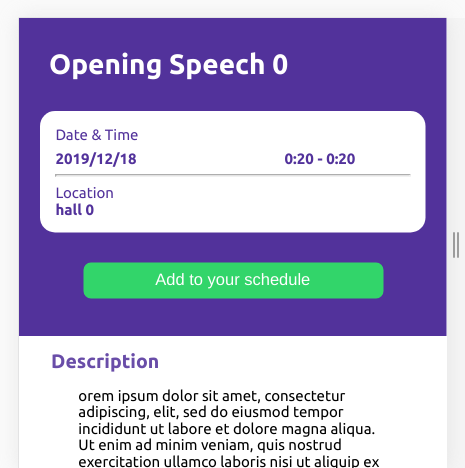
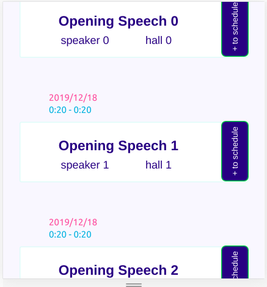

# Conference schedule

> 
The react app allows 
- users to view available talks,
- logged-in users to add talks to their schedule,
- logged-in users to remove talks from their schedule,
- logged-in users to view their schedule.

The app also uses a Rails [API](https://events-scheduler-api.herokuapp.com), which can be found [here](https://github.com/fatymahmed/schedule-backend) that stores the data of the users, talks and schedules.

Additional description about the project and its features.

## Built With

- React
- Redux
- Rails
- RSpec

## Live Demo

[Live Demo Link](https://conference-schedule-app.herokuapp.com/)

## Getting Started

To get a local copy up and running follow these simple example steps.

- Clone the project to your local directory

- git clone git@github.com:fatymahmed/conference-schedule-frontend.git

- Run npm install to install the required dependencies

- Run npm run start

## Authors

👤 **Fatima Ahmed**

- Github: [@githubhandle](https://github.com/fatymahmed)
- Twitter: [@twitterhandle](https://twitter.com/fatymahmed)
- Linkedin: [linkedin](https://www.linkedin.com/in/fatima-ahmed-46b01298/)

## Acknowledgments
- The design of the app was inspired by [Ibrahim Shaqura](https://www.behance.net/ibshaqura)
